## Flutter
- version: 1.22.5

### DB Schema
> ./doc/TideWallet_DBSchema_Diagram.drawio

### Class Definition
> ./doc/TideWallet_ClassDefinition_Diagram.drawio

### Interaction Diagram
> ./doc/TideWallet_Interaction_Diagram_1_CreateWallet.drawio
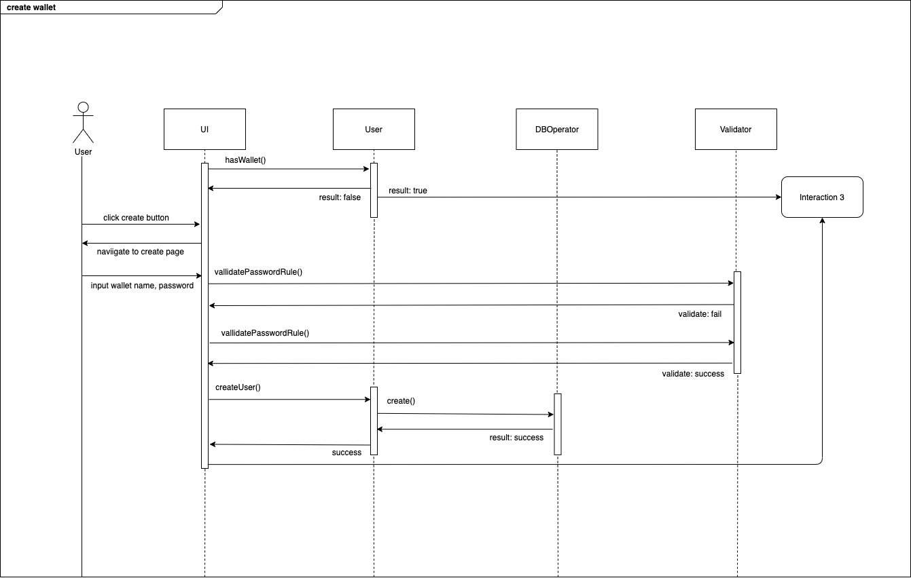

> ./doc/TideWallet_Interaction_Diagram_2_RestoreWallet.drawio
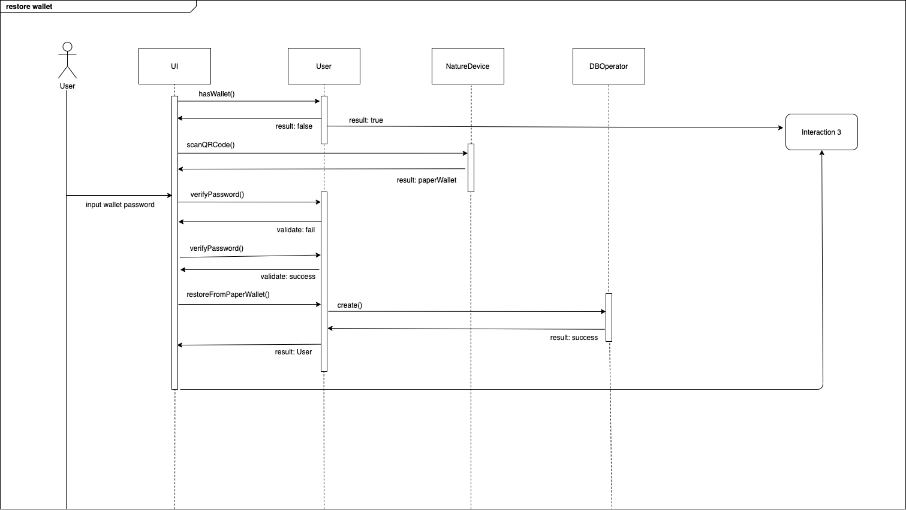

> ./doc/TideWallet_Interaction_Diagram_3_ServiceStart.drawio
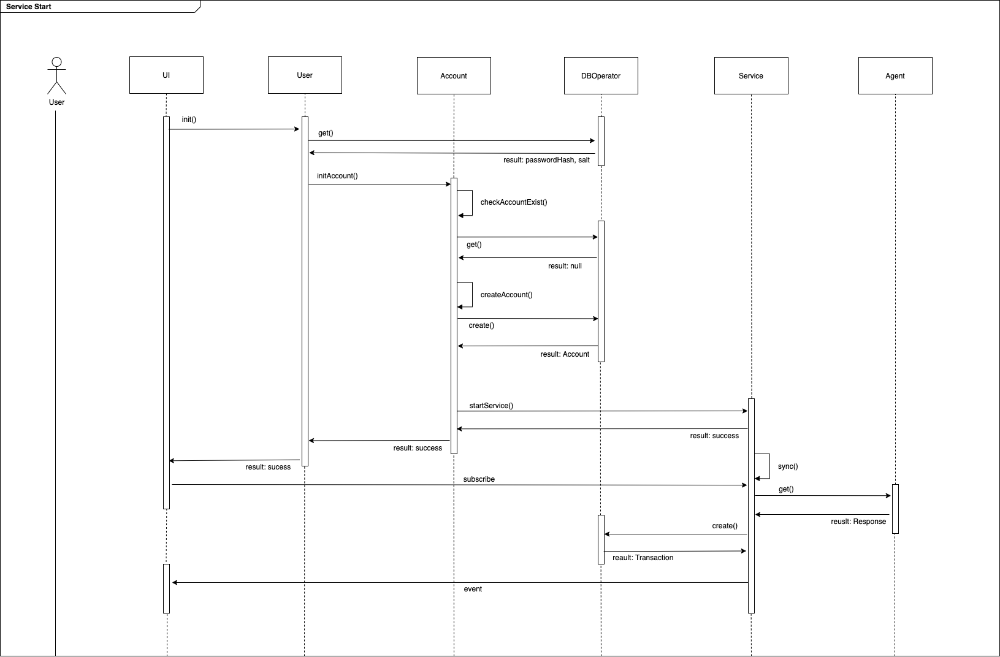

> ./doc/TideWallet_Interaction_Diagram_4_CreateToken.drawio
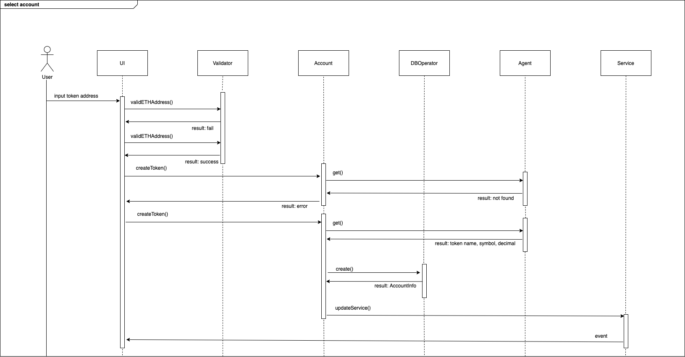

> ./doc/TideWallet_Interaction_Diagram_ReadTransaction.drawio
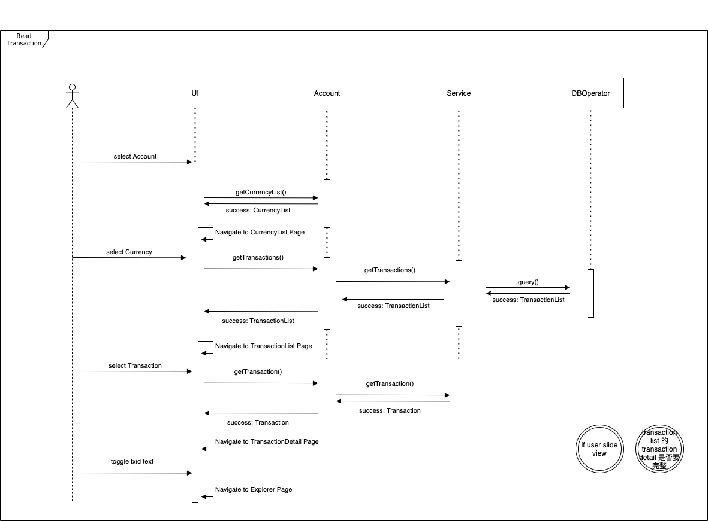

> ./doc/TideWallet_Interaction_Diagram_CreateTransaction.drawio
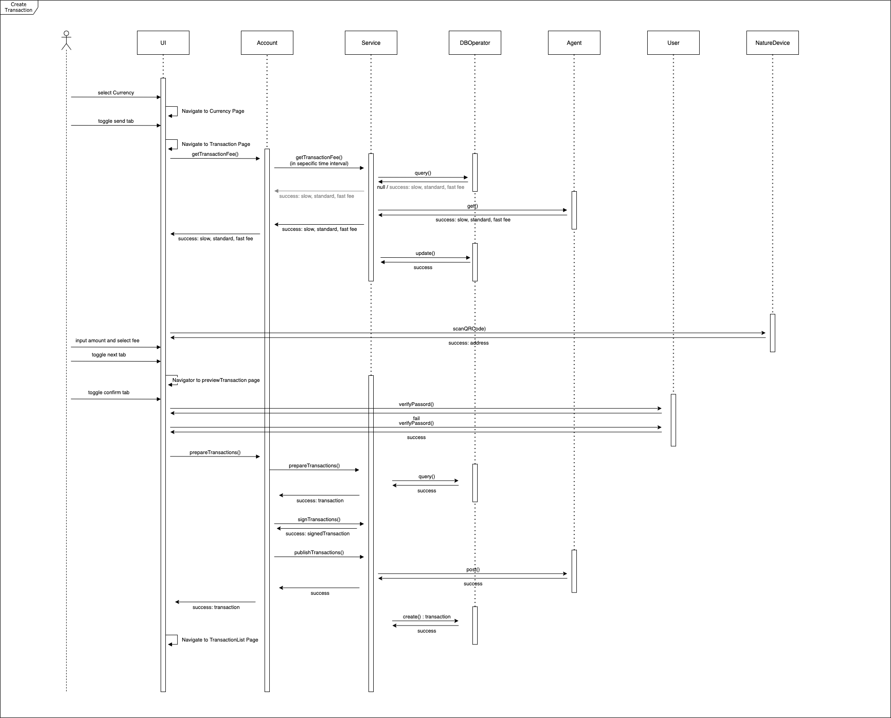

> ./doc/TideWallet_Interaction_Diagram_ReceivePayment.drawio
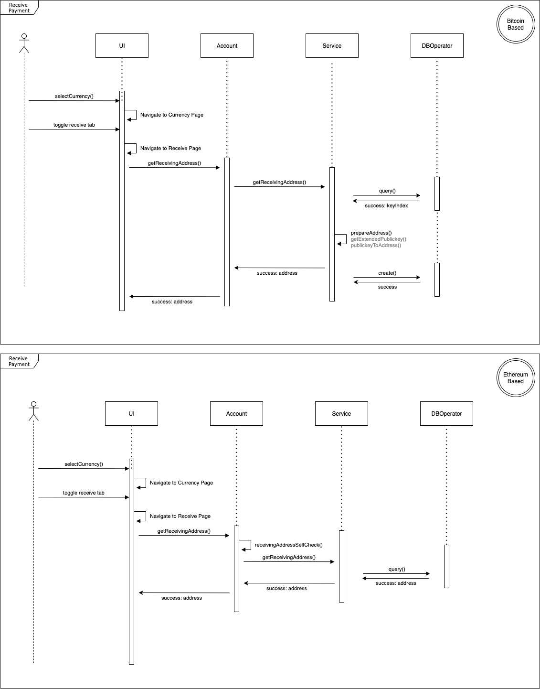

> ./doc/TideWallet_Interaction_Diagram_BackupWallet.drawio
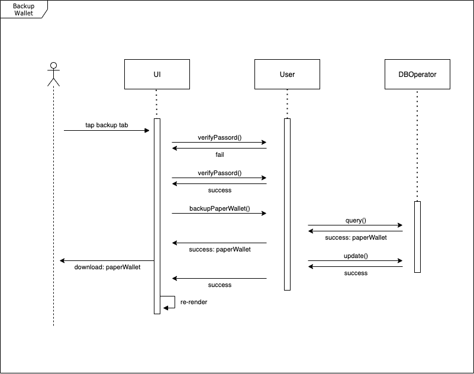

### UI Logic
> ./doc/LandingScreen.drawio
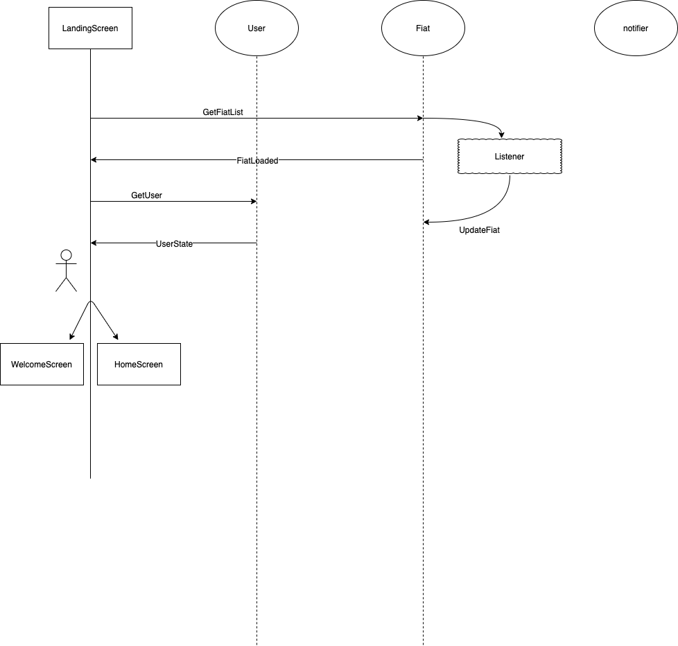

> ./doc/WelcomeScreen.drawio
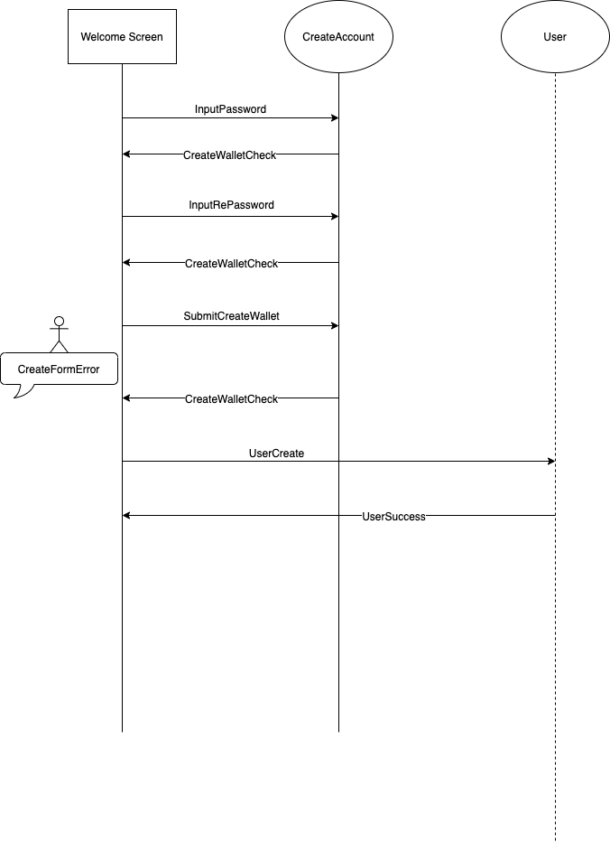

> ./doc/RestoreWalletScreen.drawio
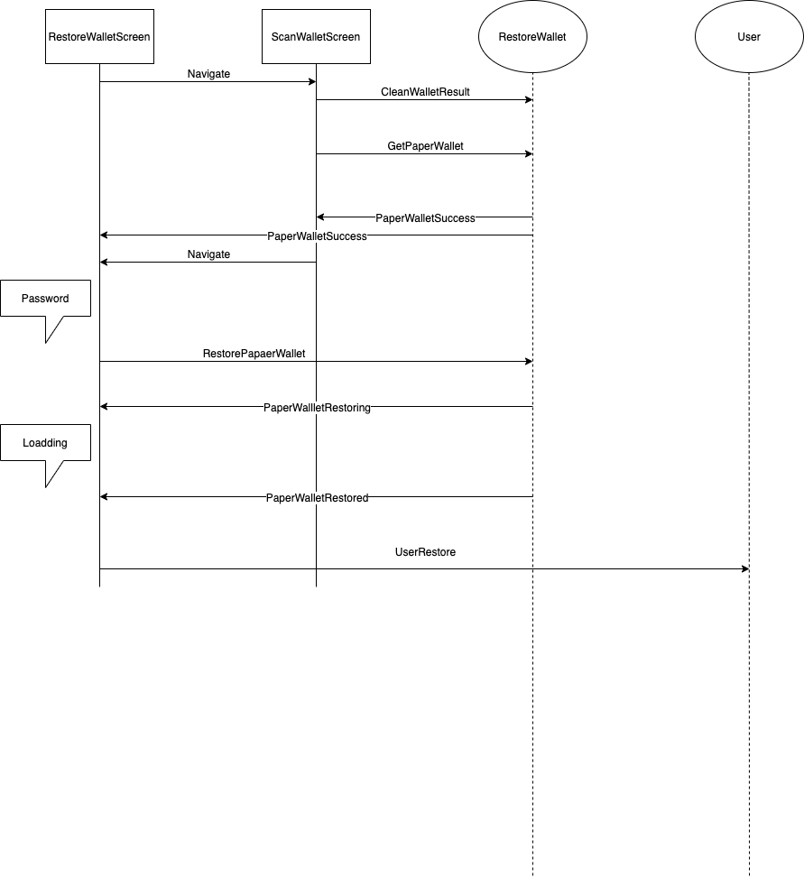

> ./doc/AccountScreen.drawio

> ./doc/CurrencyScreen.drawio
